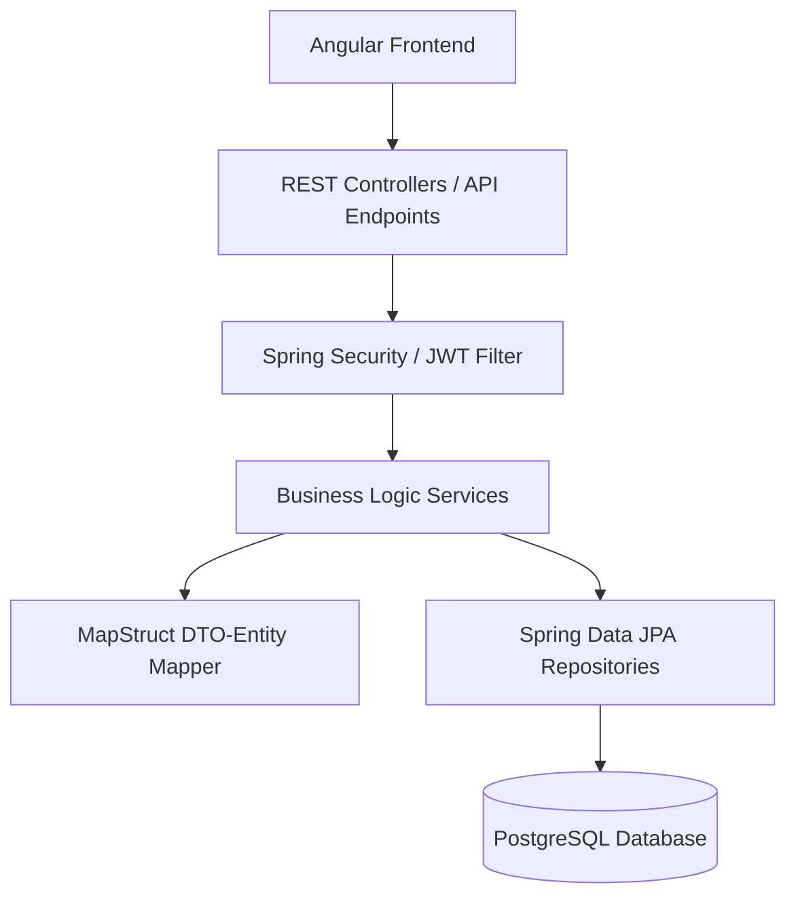

# Smart Task Management System (Do IT) — Backend API

A production-grade, highly optimized backend for the **Do IT** task management platform, built using **Spring Boot 4.1** and **Java 21**. It delivers secure user authentication, responsive task management services, background reminder execution, and AI-driven daily productivity planning.

---

## 🏗️ Architecture & Tech Stack

### Core Technologies
- **Java 21**: Leveraging modern language features (records, enhanced pattern matching).
- **Spring Boot 4.1.0**: Providing the foundational framework for REST API, scheduling, and configuration.
- **Spring Security & JWT**: Standard-compliant stateless authorization and custom JWT token issuance/validation.
- **Spring Data JPA & Hibernate**: Object-relational mapping and database access layer.
- **PostgreSQL**: Production-grade relational database.
- **Flyway Migrations**: Single consolidated schema management (`V1__init.sql`) ensuring database version alignment.
- **MapStruct 1.6.3**: Fast, type-safe compiler-generated bean mapping between DTO records and database entities.

### System Architecture
The backend follows a clean, decoupled n-tier architecture:


---

## 🌟 Key Features

1. **AI Daily Productivity Planner**: Utilizes the Google Gemini API to analyze a user's task priorities, durations, and due dates, generating a structured, prioritized daily schedule. Fallback algorithm optimizes scheduling locally if the AI service is unavailable.
2. **Task Reminders & Scheduling**: A scheduled background thread polls for pending tasks requiring reminders and dispatches email notifications using custom-configured SMTP relays.
3. **Task & Subtask Management**: Full CRUD support for tasks, subtasks (checklists), category labels, and tagging.
4. **Soft Deletion**: Tasks feature logical soft deletion (`deleted_at IS NULL`) to protect user data from accidental purging.
5. **Database Optimization**: Custom partial indexing ensures O(1) performance for active, user-scoped tasks, reminders, and category naming constraints.

---

## 🛠️ Database Indexing Strategy

To maintain maximum read performance, the database schema utilizes optimized PostgreSQL indexes:
- `uq_users_email`: O(1) B-tree lookup on email logins and unique verification.
- `uq_categories_user_name` & `uq_tags_user_name`: Composite unique case-insensitive (`lower(name)`) constraint index per user.
- `idx_tasks_user`: A partial index `ON tasks (user_id) WHERE deleted_at IS NULL` to speed up all active dashboard queries.
- `idx_tasks_title_trgm`: A GIN (Generalized Inverted Index) trigram index supporting fast, typo-tolerant full-text searches.
- `idx_reminders_due`: A partial index `ON reminders (remind_at) WHERE sent_at IS NULL` supporting the high-frequency reminder dispatcher.

---

## ⚙️ Environment Variables & Configuration

The application requires the following environment variables at runtime:

| Variable | Description | Default |
| :--- | :--- | :--- |
| `PORT` | Server listening port | `8080` |
| `DB_URL` | PostgreSQL JDBC connection URL | `jdbc:postgresql://localhost:5432/tms_backend` |
| `DB_USERNAME` | PostgreSQL database user | `tms` |
| `DB_PASSWORD` | PostgreSQL database password | `tms` |
| `JWT_SECRET` | Secret key for signing JWT tokens | `dev-only-insecure-secret-change-me...` |
| `SMTP_USERNAME` | SMTP host relay username | *(Required for reminders)* |
| `SMTP_PASSWORD` | SMTP host relay password | *(Required for reminders)* |
| `SMTP_FROM_ADDRESS` | Outgoing email From header | *(Required for reminders)* |
| `GEMINI_API_KEY` | Gemini developer API key | *(Required for AI planning)* |

---

## 🚀 Running Locally

1. Ensure a PostgreSQL instance is running with a database named `tms_backend`.
2. Configure environment variables or append them to the maven command.
3. Run the Spring Boot application:
   ```bash
   ./mvnw spring-boot:run
   ```
4. Verify the server is running on `http://localhost:8080/`.
